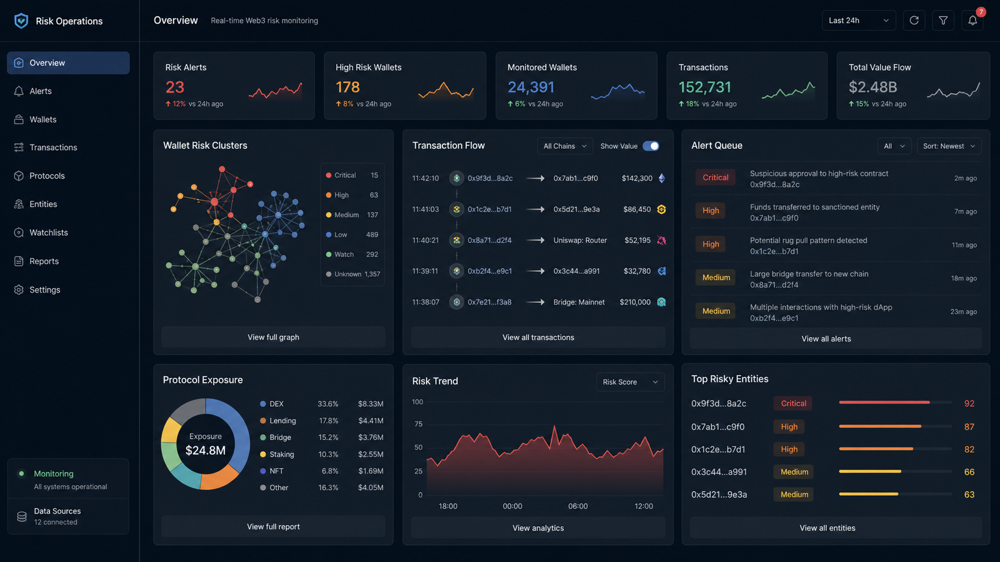
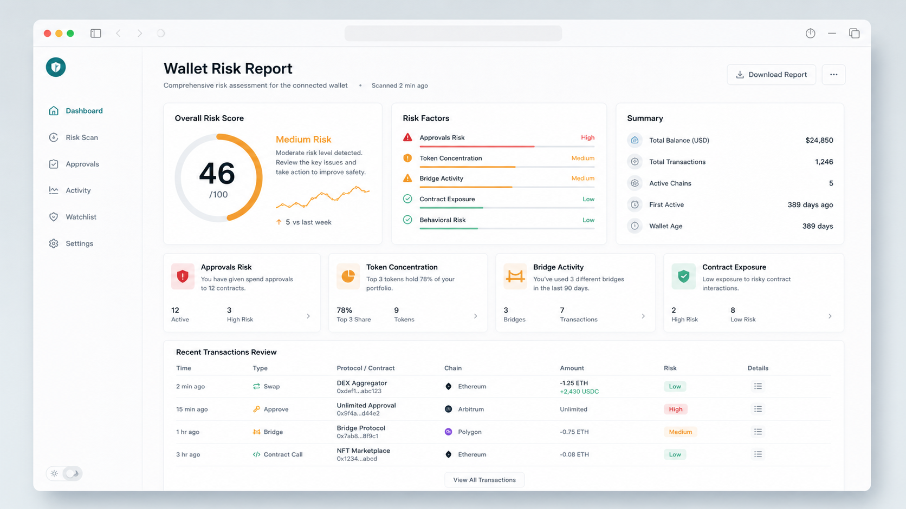
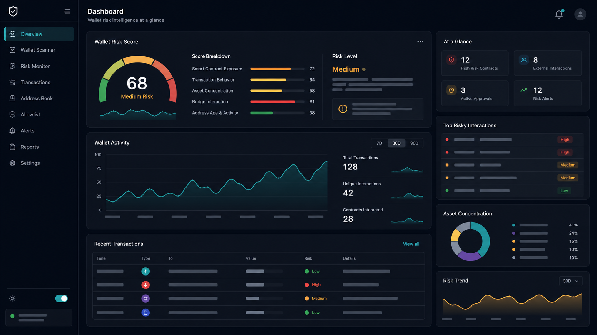
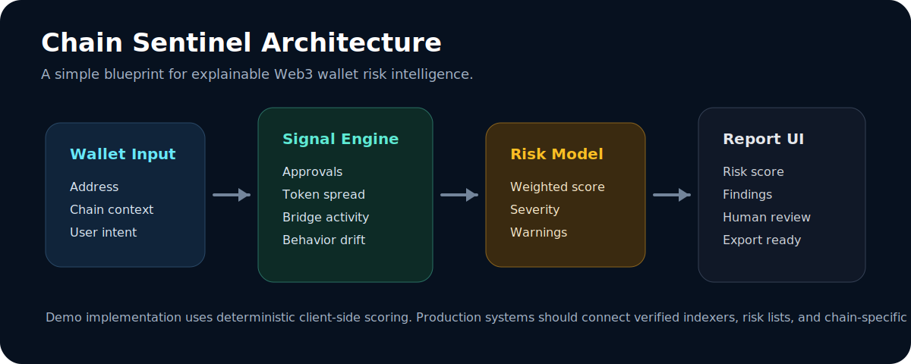

# Chain Sentinel

<p align="center">
  
</p>

<h1 align="center">Chain Sentinel</h1>

<p align="center">
  <strong>Original Web3 Wallet Risk Scanner · 原创 Web3 钱包风险扫描器</strong>
</p>

<p align="center">
  A lightweight front-end demo for explainable wallet risk analysis: contract exposure, token concentration, bridge activity, behavior drift, and human-readable findings.
  <br />
  一个轻量级 Web3 风险分析项目：把钱包地址转化为可读的风险评分、行为信号和人工审查建议。
</p>

<p align="center">
  <a href="https://github.com/jsdnaasd/chain-sentinel/stargazers"></a>
  
  
</p>

---

## Why

Most wallet tools show balances and transactions. Chain Sentinel focuses on a different question:

> Should this wallet activity be reviewed before a user, trader, founder, or protocol operator trusts it?

The demo turns wallet input into an explainable risk report. It is intentionally simple, frontend-only, and easy to extend into a real product connected to indexers, risk lists, token metadata, bridge data, and contract intelligence.

Chain Sentinel 不是普通的钱包余额查询工具，而是面向风险判断：通过钱包地址生成风险评分、行为解释和人工审查建议。它可以作为 Web3 安全产品、钱包工具、链上监控系统或投研后台的原型基础。

It is built to show practical Web3 data product thinking:

- 钱包地址风险评分
- 合约交互暴露分析
- Token 集中度分析
- 跨链桥行为提示
- 钱包行为漂移检测
- 可解释风险报告 UI

## Product Preview

<p align="center">
  
</p>

<p align="center">
  
</p>

## Features

- **Explainable scoring**: every score comes with readable findings.
- **Client-side demo engine**: no wallet address is sent to a backend.
- **No framework required**: runs as a static site.
- **Production-ready direction**: easy to connect to real chain indexers later.
- **Clean product surface**: landing page, scanner panel, signal model, and report-style visuals.

- **可解释评分**：每个分数都对应可读的风险发现。
- **前端本地 demo**：钱包地址不会发送到任何后端。
- **无需框架**：作为静态站点即可运行。
- **方便产品化**：后续可以接入真实链上索引器、风险名单和合约情报。
- **展示面完整**：包含产品首页、扫描面板、信号模型和报告风格配图。

## Architecture

<p align="center">
  
</p>

```text
Wallet Input
  -> On-chain Signal Extractor
  -> Risk Scoring Engine
  -> Explainable Findings
  -> Human Review UI
```

生产化可以接入：

- Etherscan / Blockscout / Alchemy / Covalent / The Graph
- Scam address lists and contract risk databases
- Token metadata and liquidity sources
- Bridge event indexers
- LLM-generated report summaries with strict guardrails

## Run Locally

Because this is a static frontend, you can open `index.html` directly or serve it locally:

```bash
python3 -m http.server 5173
```

Then open:

```text
http://localhost:5173
```

## Roadmap

- Real EVM transaction ingestion
- Wallet approval risk scanner
- Contract reputation layer
- ENS and address book support
- Exportable PDF risk report
- Optional LLM summary with source-grounded findings

## Disclaimer

This project is for engineering demonstration and risk research only. It does not provide financial advice, investment advice, or definitive security guarantees.

本项目仅用于工程展示和风险研究，不构成投资建议、金融建议或安全保证。
